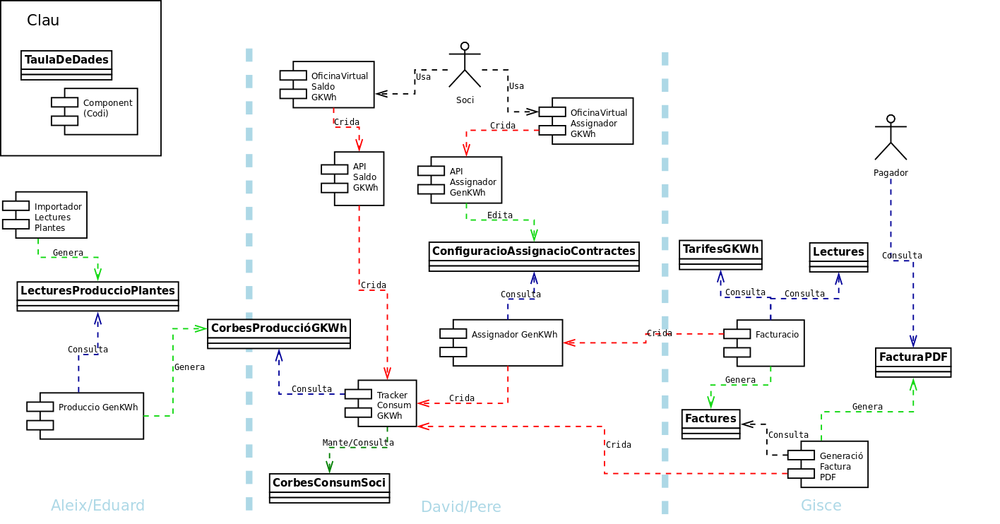

# API proposal

-  Generationkwh.Dealer

  - `available_kwh(contract, start_date, end_date, periode) : kwh`
  - `use_kwh(contract, start_date, end_date, periode, kwh): actualKwh`
  - `refund_kwh(contract, start_date, end_date, periode, kwh)`

- Generationkwh UseTracker

  - Dealer protocol (used by Generationkwh.Dealer)

    - `available_kwh(soci, start_date, end_date, periode): kwh`
    - `use_kwh(soci, start_date, end_date, periode, kwh)`
    - `refund_kwh(soci, start_date, end_date, periode, kwh)`

  - protocol Stats (used by Virtual Office and Invoice Generator)

    - `disponible(soci, start_date, end_date): corbaKwh`
    - `produccio(soci, start_date, end_date): corbaKwh`
    - `dretsNoGastats(soci, start_date, end_date): corbaKwh`
    - `dretsCaducats(soci, start_date, end_date): corbaKwh`
    - `dretsEnPerillDeCaducarse(soci, start_date, end_date) : (kwh, data)+`

