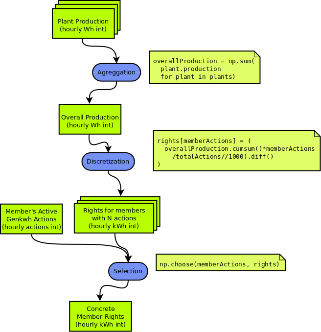

# From plant production curves to kWh use rights

1. Partim de corbes de produccio de les plantes (Wh enters cada hora?)
2. Calculem corba agregada de produccio de les plantes  (Wh enters cada hora)
3. Calculem els Wh proporcionals que els hi toca als que tenen 1, 2, 3, 4... 300 accions energetiques
  - Multipliquem per les accions (1, 2, 3... 300)
  - Dividim pel total d'accions de tots els socis actives cada hora (si es que canvia)
4. Discretitzem en kWh (sense perdre restos)
  - Integrem (cumsum)
  - Divisio entera per 1000 ( // 1000 )
  - Diferenciem (diff)
5. Per tenir en compte transicions per activacio o desactivació d'accions
    construim la corba final de drets consolidats d'un soci concret
    concatenant les corbes del punt 4 segons les accions que tingui
    activades a cada hora.

Las coses a pensar son:

- En general revisar que la proposta sigui correcta
- Quina informacio (resultats de pas) enmagatzemem i quina calculem?
- Donat que la informació de produccio vindra a tongades, com anem actualitzant
les dades de produccio disponible?
- Que passa si les dades de produccio varien i ja s'han repartit kWh a factures.
- Si considerem intervals de temps diferents, es possible que un kWh discretitzat
balli amunt i avall, Proposo que els passos 1-4 es calculin de forma centralitzada
amb intervals donats i que es mantingui percadascu les sobres del darrer repartiment.

