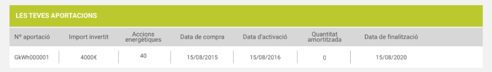
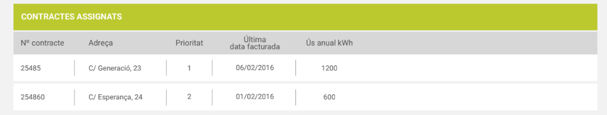
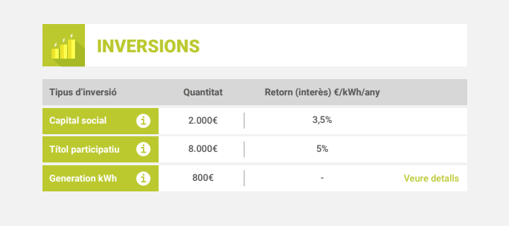

# API Generation kWh per la oficina virtual

## Inversions Generation kWh

{width="6.2709in" height="0.9307in"}

`erp.ResPartner.www_generationkwh_investments(partner_id)`

Retorna una llista de diccionaris amb:

-   `id`: No el mostrem pero es farà servir per fer accions en el futur
-   `name`: Nº Aportació (referencia per l’usuari)
-   `active`: No mostrar la inversió si es False
-   `draft`: No mostrar la inversió si es True
-   `nshares`: Accions energètiques
-   `nominal_amount`: Import invertit
-   `amortized_amount`: Quantitat amortitzada (a la pantallada falta el
    €: “0€”)
-   `purchase_date`: Data de compra
-   `first_effective_date`: Data d’activació
-   `last_effective_date`: Data de finalització
-   `order_date`: (ignorat) data de comanda, quan s’omplí el formulari
-   `member_id`: (ignorat) id del SomenergiaSoci, no pas del ResPartner

Nota: Les dates poden ser False.

## Assignacions Generation kWh

{width="6.2709in" height="1.1945in"}

`erp.ResPartner.www_generationkwh_assignments(partner_id)`

- `id`: No el mostrem pero es farà servir per fer accions en el futur
- `contract_id`: No el mostrem pero es farà servir per fer accions en el futur
- `annual_use_kwh`: “Ùs anual kWh”
- `contract_address`: “Adreça”
- `contract_last_invoiced`: “Última factura facturada”
- `contract_name`: “Nº de Contracte”
- `contract_state`: Segurament ho visualitzarem en el futur
- `priority`: “Prioritat”
- `member_id`: (ignorat) id del SomenergiaSoci, no pas del ResPartner
- `member_name`: (ignorat)

## Pàgina sumari d’inversions

Per obtindre la “Quantitat” invertida a la fila “Generation kWh” cal
sumar, per totes les inversions del generation, la resta del
`nominal_amount` amb l’`amortized_amount`.

Les altres files, de moment, no les posem. Hem d’afegir api per
obtindre-les.

A la capçalera Retorn caldria eliminar la part del “€/kWh/any” i deixar
“Retorn (interès)”.

{width="6.2709in" height="2.7917in"}

## Exemples d’ús:


```python
In [1]: import erppeek; import dbconfig; erp=erppeek.Client(**dbconfig.erppeek)

In [2]: erp.ResPartner.www_generationkwh_investments(2)
Out[2]:
[
 {'active': True,
  'amortized_amount': 120.0,
  'draft': False,
  'first_effective_date': '2016-10-20',
  'id': 1643,
  'last_effective_date': '2040-11-20',
  'member_id': [1, 'Gijsbertus Adrianus Johannes Huijink'],
  'name': 'GKWH01592',
  'nominal_amount': 3000.0,
  'nshares': 30,
  'order_date': '2015-11-19',
  'purchase_date': '2015-11-20'},
 {'active': True,
  'amortized_amount': 120.0,
  'draft': False,
  'first_effective_date': '2016-10-20',
  'id': 1642,
  'last_effective_date': '2040-11-20',
  'member_id': [1, 'Gijsbertus Adrianus Johannes Huijink'],
  'name': 'GKWH01591',
  'nominal_amount': 3000.0,
  'nshares': 30,
  'order_date': '2015-11-19',
  'purchase_date': '2015-11-20'},
]
  
In [3]: erp.ResPartner.www_generationkwh_assignments(2)
Out[3]:
[{'annual_use_kwh': 6941,
  'contract_address': 'Sesame Street (Franklin Park)',
  'contract_id': 20671,
  'contract_last_invoiced': '2018-05-31',
  'contract_name': '11129',
  'contract_state': 'activa',
  'id': 3,
  'member_id': 1,
  'member_name': 'Gijsbertus Adrianus Johannes Huijink',
  'priority': 0},
 {'annual_use_kwh': 7706,
  'contract_address': 'Percebe, 13 (Villatorrijo)',
  'contract_id': 34524,
  'contract_last_invoiced': '2018-05-31',
  'contract_name': '17132',
  'contract_state': 'activa',
  'id': 2261,
  'member_id': 1,
  'member_name': 'Gijsbertus Adrianus Johannes Huijink',
  'priority': 1},
 {'annual_use_kwh': 7148,
  'contract_address': 'Hoyo, 14 (Murcia)',
  'contract_id': 34516,
  'contract_last_invoiced': '2018-05-31',
  'contract_name': '17128',
  'contract_state': 'activa',
  'id': 2262,
  'member_id': 1,
  'member_name': 'Gijsbertus Adrianus Johannes Huijink',
  'priority': 2 },
]
```
